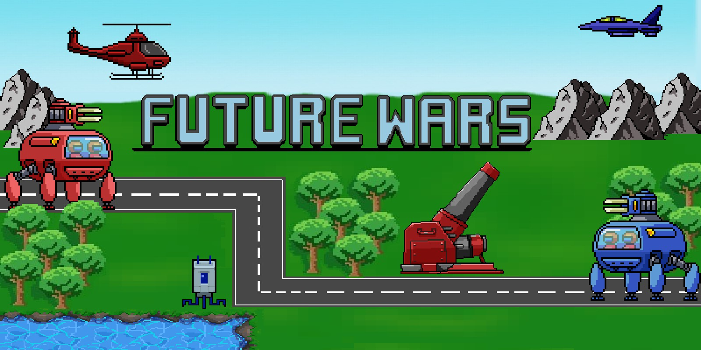

# Future Wars


By Simon Blum, Elena Schwarzbach, Sonia Sinacci, Max Rodler.
<br><br>
**For more information check the [documentation](https://dhbwprojectsit23.github.io/JavaGame/starter-topic.html)**
<br><br>

## Starting the game

The project is build using Maven and should be runnable by using:
```shell
mvn clean javafx:run
```

_Note: Due to the way Maven seems to try and catch the JavaFX dependencies
executing this command from a linux shell does not seem to work. \
On Windows no problems were encountered, on Linux the application could
be started using IntelliJ. Building over GitHub Action also caused no issues._